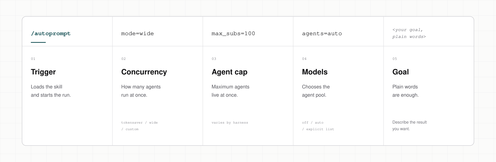
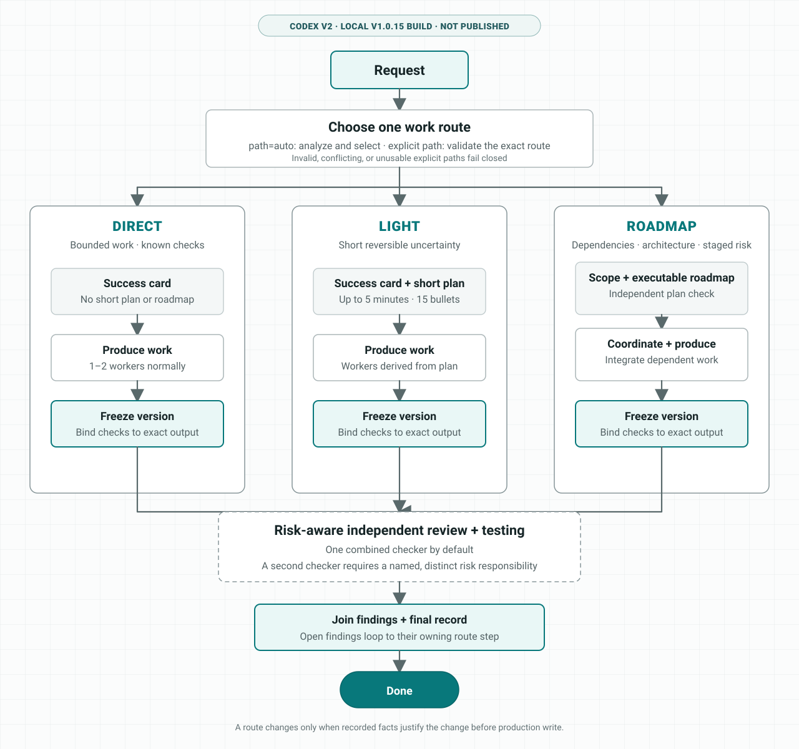
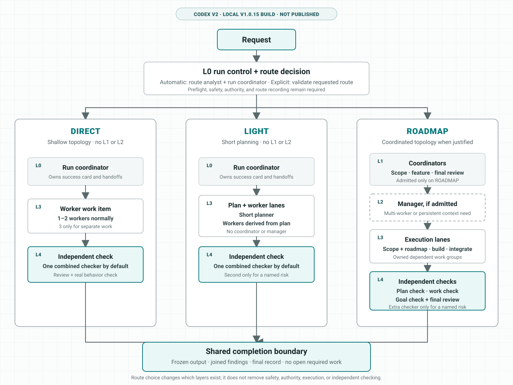

<h1 align="center">Autoprompt</h1>

<p align="center">Autoprompt is a coding-agent skill for explicit routing, bounded delegation, and evidence-backed checks.</p>

<p align="center">
  <a href="https://github.com/Spielewoy/autoprompt-skill/releases/latest"></a>
  <a href="#install"></a>
  <a href="LICENSE"></a>
</p>

<p align="center">
  <a href="README.md"><b>English</b></a> |
  <a href="https://github.com/Spielewoy/autoprompt-skill/blob/main/docs/translations/zh.md">中文</a> |
  <a href="https://github.com/Spielewoy/autoprompt-skill/blob/main/docs/translations/ko.md">한국어</a> |
  <a href="https://github.com/Spielewoy/autoprompt-skill/blob/main/docs/translations/es.md">Español</a> |
  <a href="https://github.com/Spielewoy/autoprompt-skill/blob/main/docs/translations/ar.md">العربية</a>
</p>

## Contents

[Install](#install) · [Benchmarks](#benchmarks) · [Invocation](#anatomy-of-an-invocation) · [Run controls](#run-controls) · [Workflow](#how-it-works) · [Agents](#the-agents) · [Examples](#examples) · [FAQ](#faq) · [License](#license)

## Install

Use the CLI below, or download an installer from [GitHub Releases](https://github.com/Spielewoy/autoprompt-skill/releases/tag/v1.0.4).

### 1. Install the CLI

```bash
npm install -g autoprompt-skill
```

### 2. Launch the installer

```bash
autoprompt
```

### 3. Install

Choose your coding agent, confirm its path, and install. `N` means enter another path.

For another CLI or IDE, choose `Custom coding agent` and use the [compatibility guide](docs/guides/custom-agent-compatibility.md).

<details>
<summary><strong>Install from source</strong></summary>

```bash
git clone https://github.com/Spielewoy/autoprompt-skill
cd autoprompt-skill
npm install -g .
autoprompt
```

</details>

### Codex-only local package

`autoprompt-skill` is the multi-provider aggregate. For an offline checkout that
needs only Codex, `@autoprompt-skill/codex-runtime` is the Codex-only local v1.0.14
package; it is not published. Stage and run it without installing the aggregate:

```bash
node scripts/codex-artifact.cjs --stage <absolute-directory>
node <absolute-directory>/bin/autoprompt-codex.cjs install --root <absolute-CODEX_HOME>
```

Its package metadata has 0 npm dependencies and 0 optional dependencies. The final
frozen repack writes the authoritative measurements to
`packages/codex/release.json`: `packedBytes`, `fileCount`, and
`externalDependencyCount`. Until that repack completes, do not infer provisional
values from the changing working tree. The final pack command is:

```bash
node scripts/codex-artifact.cjs --pack --destination <absolute-directory>
```

### Requirements

- [Node.js 20+](https://nodejs.org/en/download)
- [Python 3.11+](https://www.python.org/downloads/) exposed as `python`, with [PyYAML](https://pypi.org/project/PyYAML/)
- [Bash 4.3+](https://www.gnu.org/software/bash/) on macOS or Linux
- [Git](https://git-scm.com/downloads) only for the GitHub checkout method

### Support

The v2 work on this development branch is Codex-first. The other provider rows below
describe the existing released adapters; they have not been migrated to the Codex v2
hierarchy or runtime in this branch.

<!-- codex-v2-release-status: local-v1.0.14-build-not-published -->
Codex v2 is available in this checkout as a local v1.0.14 build. It has
not been published or pushed. Its local transcript, retention, and export-authority
boundary is documented in the
[Codex v2 local-record guide](docs/guides/codex-v2-local-records.md).

| Status | Coding agent | Audited requirement | Key |
|---|---|---|---|
| Working | [Claude Code](https://code.claude.com/docs/en/setup) | 2.1.219+; audited 2.1.233 | `claude` |
| Working | [Codex](https://github.com/openai/codex) | Subagent-capable build; current v2 work audited with 0.148.0 | `codex` |
| Working | [OpenCode](https://opencode.ai/docs/agents) | 1.18.7+; audited 1.18.18 | `opencode` |
| Working | [Kilo Code](https://kilo.ai/docs/customize/custom-subagents) | 7.4.22+; audited 7.4.22 | `kilo` |
| Working | [VS Code](https://code.visualstudio.com/docs/agents/subagents) | 1.133+; audited 1.133.0 with Copilot 0.61.0 | `vscode` |
| Working | [Prime Agent](https://github.com/PrimeIntellect-ai/prime-agent) | 0.7.2; audited 0.7.2; native package adapter | `prime` |
| Working | [Oh My Pi](https://omp.sh/) | 17.4.0+; adapter contract, install lifecycle, and native role payload verified for 17.4.0 | `omp` |
| Working | [DeepSeek Harness](https://deepseek.com/harness/en/) | 0.1.0-rc.7+; adapter contract, install lifecycle, and native role payload verified for 0.1.0-rc.7 | `deepseek` |
| Working | [Reasonix](https://reasonix.io/docs/) | 1.30.0+; adapter contract, install lifecycle, and native role payload verified for 1.30.0 | `reasonix` |

See [support and audit notes](docs/faq/which-coding-agents-are-supported.md).

### Check, update, or remove an installation

- Check every detected installation: `autoprompt doctor --strict`
- Check one provider: `autoprompt doctor PROVIDER --strict`
- Update or repair: `autoprompt`, then choose an installed provider
- Uninstall interactively: `autoprompt uninstall`
- Uninstall one provider: `autoprompt uninstall PROVIDER`
- Show every command: `autoprompt help`

For Codex, `verifies=yes` proves the installed payload and static activation
prerequisites. The doctor row also says `dynamic-preflight-required` because every
activation separately re-proves the command sandbox and network boundary before it
starts a model.

Replace `PROVIDER` with a key from the support table, such as `claude`, `codex`, or `prime`.

## Benchmarks

Autoprompt currently makes no reproducible performance or cost-reduction claim. A historical Terminal-Bench comparison was previously shown here, but its treatment-side per-task evidence and timing/token logs were not retained, so it cannot be reconstructed or treated as a controlled result. See the [archived evidence boundary](docs/benchmarks/terminal-bench-2.1.md).

Future benchmark results must come from a preregistered task catalog, paired repetitions, immutable content-addressed evidence, mandatory canaries, and a signed aggregate report before publication.

The [2026-08-22 Codex canary](docs/benchmarks/codex-canary-2026-08-22.md) is a
diagnostic record, not a benchmark result: the installed path stopped at the dynamic
network boundary before routing or model execution.

## Anatomy of an invocation

<p align="center">
  <a href="assets/anatomy.svg"></a>
</p>

## Run controls

Use `mode=` to set concurrency. Use `agents=` to route models where the host supports it. The optional Codex v2 `path=` control is present in the local v1.0.14 build; it has not been published. [Custom model setup](docs/faq/how-to-add-custom-models.md)

| Control | Claude Code | Codex | OpenCode | Kilo | VS Code | Prime Agent | Oh My Pi | DeepSeek Harness | Reasonix |
|---|:---:|:---:|:---:|:---:|:---:|:---:|:---:|:---:|:---:|
| `mode=` | ✓ | ✓ | ✓ | ✓ | ✓ | ✓ | ✓ | ✓ | ✓ |
| Custom `agents=` routing | ✓ | ✓ | ✕ Not available - inherits active model | ✕ Not available - inherits active model | ✕ Not available - inherits active model | ✕ Not available - inherits selected parent model | ✕ Not available - inherits selected parent model | ✕ Not available - inherits selected parent model | ✕ Not available - inherits selected parent model |
| `path=` work route | - | Local v1.0.14 build; not published | - | - | - | - | - | - | - |

For local-build testing, use the Codex v2 launcher and put
`path=auto|direct|light|roadmap` first inside its quoted request. The slash-command
form shown for other providers does not support `path=`:

```bash
autoprompt activate codex -- "path=direct fix the registration race and run the focused test"
```

Omitting `path=` is the same as `path=auto`: the route analyst and L0 select the
smallest sufficient route. An explicit `direct`, `light`, or `roadmap` skips all
route-analysis and route-selection model work and enters that exact route. It still
creates the required route record and does not skip safety and authority checks,
route-specific deliverables, execution, or independent verification. An invalid,
conflicting, or unusable explicit path fails closed instead of silently switching
routes.

## How it works

These diagrams describe the local Codex v1.0.14 build; it has not been published.
Codex v2 chooses one route instead of forcing every request through a full roadmap:
DIRECT uses a success card, LIGHT adds a short plan, and ROADMAP alone adds full
scope, roadmap review, coordination, and integration. Independent checking remains
required, while a second checker is added only for a named, distinct risk.

<p align="center">
  
</p>

## The agents

<p align="center">
  
</p>

## Examples

| Goal | Prompt |
|---|---|
| Fix | `/autoprompt fix the registration race and add a regression test` |
| Build | `/autoprompt mode=wide build the booking flow from API to checkout` |
| Research | `/autoprompt compare job queues against this codebase and recommend one` |
| Limit parallel work | `/autoprompt mode=custom max_subs=4 migrate every model` |
| Test a local Codex v2 path | `autoprompt activate codex -- "path=light add retry behavior and cover its edge cases"` |

In Oh My Pi, use `/skill:autoprompt`. Codex v2 is entered through the external launcher; users do not type the internal
`$autoprompt` envelope:

```bash
autoprompt activate codex -- "fix the registration race and run the focused test"
```

## FAQ

<details>
<summary><strong>Does Autoprompt mean I literally do not have to prompt?</strong></summary>

No. Give it a clear goal, constraints, and success criteria. Autoprompt handles the execution loop, so you do not have to prompt every step. [Details](docs/faq/does-autoprompt-mean-i-do-not-have-to-prompt.md)

</details>

<details>
<summary><strong>How autonomous is Autoprompt?</strong></summary>

It can scope, implement, test, review, repair, and verify a goal. It stops for choices that change the result, actions that need your authority, or blockers it cannot safely resolve. [Details](docs/faq/how-autonomous-is-autoprompt.md)

</details>

<details>
<summary><strong>What are the layers for?</strong></summary>

The layers separate coordination, management, execution, and independent judgment. That separation keeps one agent from planning, approving, and verifying its own work. [Details](docs/faq/what-are-the-layers-for.md)

</details>

<details>
<summary><strong>What do `mode`, `max_subs`, `agents`, and `path` do?</strong></summary>

`mode=tokensaver` caps active subagents at six. `mode=wide` opens every ready lane. `mode=custom max_subs=N` sets your own ceiling. `agents` controls model routing where the host supports it. The local, unpublished Codex v1.0.14 build optionally uses `path` to fix the work route; when omitted, routing stays automatic. [Details](docs/faq/tokensaver-vs-wide-vs-custom.md)

</details>

<details>
<summary><strong>Why does Autoprompt not start in the background?</strong></summary>

Because it changes cost, time, and workflow. Start it explicitly with `/autoprompt <goal>` on compatible hosts. For Codex v2 use `autoprompt activate codex -- <goal>`.

</details>

## License

[MIT](LICENSE). Copyright 2026 [Spielewoy](https://github.com/Spielewoy).

Community: [Contributing](docs/CONTRIBUTING.md), [Code of Conduct](docs/CODE_OF_CONDUCT.md), [Security](docs/SECURITY.md), and [Support](docs/SUPPORT.md).
