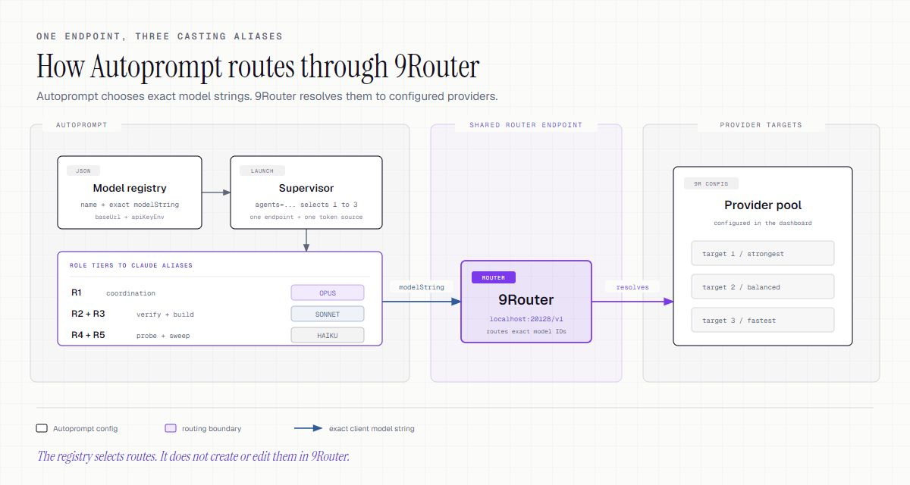

# Route Autoprompt through 9Router

[9Router](https://github.com/decolua/9router) gives Claude Code one endpoint for models from different providers. Autoprompt chooses the model string. 9Router decides where that string runs.



> Autoprompt never creates providers, models, or aliases in 9Router. Configure those routes first, then copy their exact names into the Autoprompt registry.

## 1. Start 9Router

```bash
npm install -g 9router
9router
```

| Check | Local address |
|---|---|
| Dashboard | `http://localhost:20128/dashboard` |
| API | `http://localhost:20128/v1` |
| Health | `http://localhost:20128/api/health` |

In the dashboard:

1. Connect the providers you want to use.
2. Pick at most three target models.
3. Give them stable aliases such as `autoprompt-strong`, `autoprompt-balanced`, and `autoprompt-fast`.
4. Create or copy the endpoint token.

Set that token as `AUTOPROMPT_ROUTER_TOKEN` in your shell or secret manager. Do not put its value in JSON, commands, screenshots, or logs.

## 2. Create the model registry

Save this as `~/.claude/autoprompt-models.json`:

```json
[
  {
    "name": "Strong",
    "provider": "9router",
    "modelString": "autoprompt-strong",
    "baseUrl": "http://localhost:20128/v1",
    "apiKeyEnv": "AUTOPROMPT_ROUTER_TOKEN",
    "effortHint": "max"
  },
  {
    "name": "Balanced",
    "provider": "9router",
    "modelString": "autoprompt-balanced",
    "baseUrl": "http://localhost:20128/v1",
    "apiKeyEnv": "AUTOPROMPT_ROUTER_TOKEN",
    "effortHint": "high"
  },
  {
    "name": "Fast",
    "provider": "9router",
    "modelString": "autoprompt-fast",
    "baseUrl": "http://localhost:20128/v1",
    "apiKeyEnv": "AUTOPROMPT_ROUTER_TOKEN",
    "effortHint": "low"
  }
]
```

The three selected entries must use the same `baseUrl` and `apiKeyEnv`. The registry stores the environment variable name, never the token itself.

## 3. Launch Autoprompt

macOS and Linux:

```bash
agents/claude/workflow/supervisor.sh \
  --agents "Strong,Balanced,Fast" \
  --model-registry "$HOME/.claude/autoprompt-models.json" \
  --cmd "claude -p" \
  "fix the smallest failing test"
```

PowerShell:

```powershell
powershell -File agents/claude/workflow/supervisor.ps1 `
  --agents "Strong,Balanced,Fast" `
  --model-registry "$HOME\.claude\autoprompt-models.json" `
  --cmd "claude -p" `
  "fix the smallest failing test"
```

Selection is predictable:

| Selected models | Claude Code aliases |
|---|---|
| One | Opus, Sonnet, and Haiku use that model |
| Two | Opus and Sonnet use the first; Haiku uses the second |
| Three | Opus, Sonnet, and Haiku use the first, second, and third |

Autoprompt maps R1 to Opus, R2 to Sonnet, R3 to Sonnet, R4 to Haiku, and R5 to Haiku. A fourth custom model is rejected. `agents=auto` ranks the registry by `effortHint`; an explicit list keeps your order.

## Verify

1. Check the router:

   ```bash
   curl --fail --silent --show-error http://localhost:20128/api/health
   ```

   Expected response: `{"ok":true}`

2. Validate the registry without sending a provider request:

   ```bash
   node agents/claude/workflow/model-casting.js \
     --selector "Strong,Balanced,Fast" \
     --registry "$HOME/.claude/autoprompt-models.json"
   ```

3. Run the bounded launch above. Confirm `BRIEF.md` records the three selected names and the Opus, Sonnet, and Haiku bindings.
4. Check redacted 9Router telemetry to confirm that each alias reached its intended target. Never copy authorization headers or tokens into an issue.

## Troubleshooting

| Symptom | Fix |
|---|---|
| `Model ... is not present in the registry` | Match the registry `name` exactly. Names are case-sensitive. |
| Endpoint-compatible pool error | Give every selected entry the same `baseUrl` and `apiKeyEnv`. |
| Missing credential variable | Set `AUTOPROMPT_ROUTER_TOKEN` before starting the supervisor. |
| More than three models rejected | Select one, two, or three models. Claude Code exposes three casting aliases. |
| Model pin conflict | Unset `CLAUDE_CODE_SUBAGENT_MODEL` and do not use `AUTOPROMPT_KEEP_MODEL_PIN=1` with casting enabled. |
| Provider request fails | Test the target in 9Router, then inspect redacted router logs for quota or provider errors. |

The exact registry contract lives in [`agents/claude/autoprompt-models.schema.md`](../../agents/claude/autoprompt-models.schema.md).
