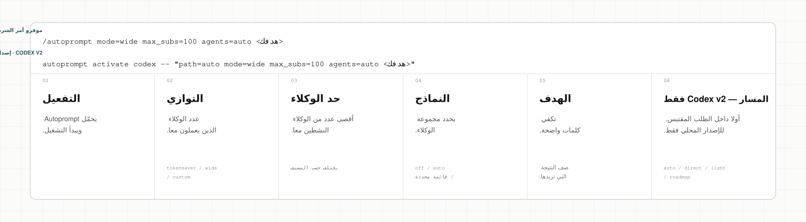
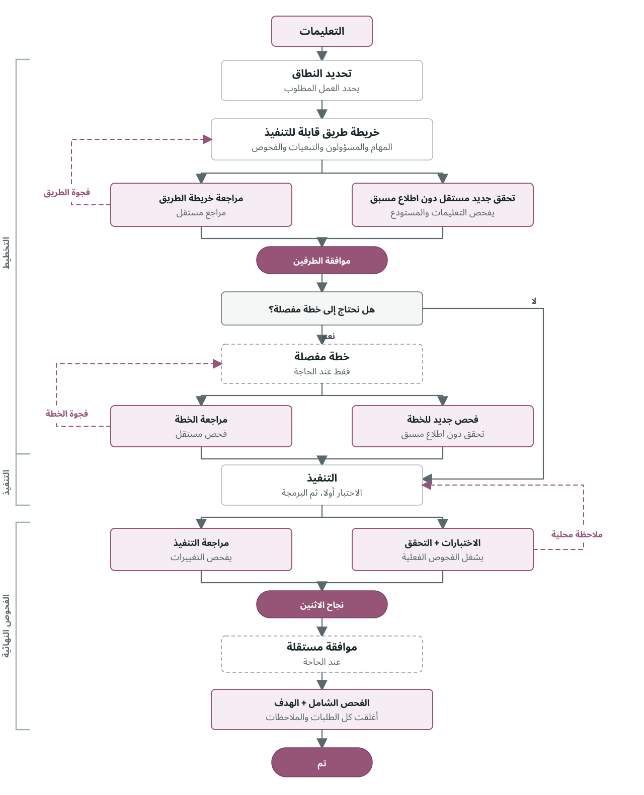
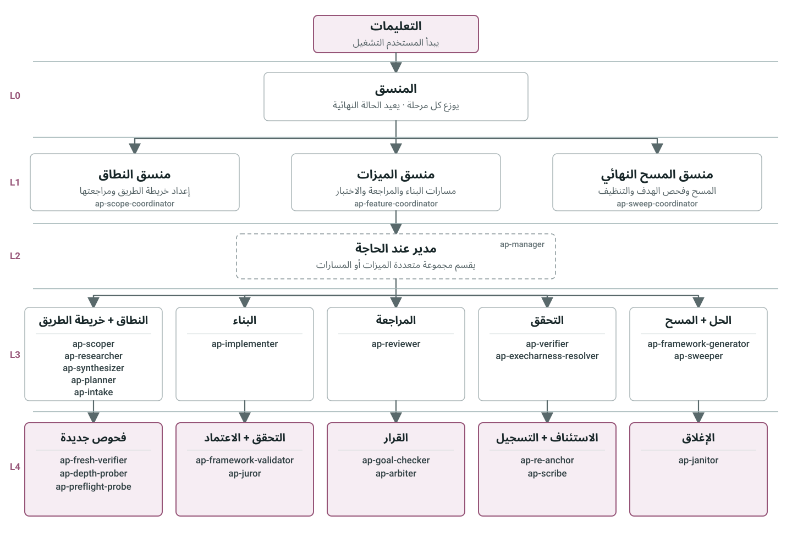

<div dir="rtl" align="right">

<h1 align="center">Autoprompt</h1>

<p align="center">Autoprompt مهارة لوكلاء البرمجة توفر توجيها صريحا وتفويضا محدودا وفحوصا قائمة على الأدلة.</p>

<p align="center">
  <a href="https://github.com/Spielewoy/autoprompt-skill/releases/latest"></a>
  <a href="#التثبيت"></a>
  <a href="../../LICENSE"></a>
</p>

<p align="center">
  <a href="../../README.md">English</a> |
  <a href="zh.md">中文</a> |
  <a href="ko.md">한국어</a> |
  <a href="es.md">Español</a> |
  <a href="ar.md"><b>العربية</b></a>
</p>

## المحتويات

[التثبيت](#التثبيت) · [النتائج](#نتائج-الاختبار-المعياري) · [الاستدعاء](#بنية-الاستدعاء) · [التحكم](#عناصر-التحكم-في-التشغيل) · [آلية العمل](#كيف-يعمل) · [الوكلاء](#الوكلاء) · [الأمثلة](#أمثلة) · [الأسئلة](#الأسئلة-الشائعة) · [الترخيص](#الترخيص)

## التثبيت

استخدم CLI أدناه أو نزل أحد المثبتات من [GitHub Releases](https://github.com/Spielewoy/autoprompt-skill/releases/tag/v1.0.4).

### 1. تثبيت CLI

```bash
npm install -g autoprompt-skill
```

### 2. تشغيل المثبت

```bash
autoprompt
```

### 3. التثبيت

اختر وكيل البرمجة، وأكد المسار، ثم ثبت. يعني `N` إدخال مسار آخر.

لاستخدام CLI أو IDE آخر، اختر `Custom coding agent` واتبع [دليل التوافق](../guides/custom-agent-compatibility.md).

<details>
<summary><strong>التثبيت من المصدر</strong></summary>

```bash
git clone https://github.com/Spielewoy/autoprompt-skill
cd autoprompt-skill
npm install -g .
autoprompt
```

</details>

### المتطلبات

- [Node.js 20+](https://nodejs.org/en/download)
- [Python 3.11+](https://www.python.org/downloads/) متاح باسم `python`، مع [PyYAML](https://pypi.org/project/PyYAML/)
- [Bash 4.3+](https://www.gnu.org/software/bash/) على macOS أو Linux
- [Git](https://git-scm.com/downloads) لطريقة نسخة GitHub فقط

### الدعم

| الحالة | وكيل البرمجة | المتطلب المدقق | المفتاح |
|---|---|---|---|
| يعمل | [Claude Code](https://code.claude.com/docs/en/setup) | 2.1.219+؛ تم تدقيق 2.1.233 | `claude` |
| يعمل | [Codex](https://github.com/openai/codex) | إصدار يدعم الوكلاء الفرعيين؛ تم تدقيق عمل v2 الحالي باستخدام 0.148.0 | `codex` |
| يعمل | [OpenCode](https://opencode.ai/docs/agents) | 1.18.7+؛ تم تدقيق 1.18.18 | `opencode` |
| يعمل | [Kilo Code](https://kilo.ai/docs/customize/custom-subagents) | 7.4.22+؛ تم تدقيق 7.4.22 | `kilo` |
| يعمل | [VS Code](https://code.visualstudio.com/docs/agents/subagents) | 1.133+؛ تم تدقيق 1.133.0 مع Copilot 0.61.0 | `vscode` |
| يعمل | [Prime Agent](https://github.com/PrimeIntellect-ai/prime-agent) | 0.7.2؛ تم تدقيق 0.7.2؛ محول حزمة أصلي | `prime` |
| يعمل | [Oh My Pi](https://omp.sh/) | 17.4.0+؛ تم التحقق من عقد الموائم ودورة التثبيت وحمولة الدور الأصلية على 17.4.0 | `omp` |
| يعمل | [DeepSeek Harness](https://deepseek.com/harness/en/) | 0.1.0-rc.7+؛ تم التحقق من عقد الموائم ودورة التثبيت وحمولة الدور الأصلية على 0.1.0-rc.7 | `deepseek` |
| يعمل | [Reasonix](https://reasonix.io/docs/) | 1.30.0+؛ تم التحقق من عقد الموائم ودورة التثبيت وحمولة الدور الأصلية على 1.30.0 | `reasonix` |

راجع [ملاحظات الدعم والتدقيق](../faq/which-coding-agents-are-supported.md).

### الفحص أو التحديث أو الإزالة

- فحص كل التثبيتات المكتشفة: `autoprompt doctor --strict`
- فحص مضيف واحد: `autoprompt doctor PROVIDER --strict`
- التحديث أو الإصلاح: شغل `autoprompt` ثم اختر مضيفا مثبتا
- الإزالة التفاعلية: `autoprompt uninstall`
- إزالة مضيف واحد: `autoprompt uninstall PROVIDER`
- عرض جميع الأوامر: `autoprompt help`

استبدل `PROVIDER` بمفتاح من جدول الدعم، مثل `claude` أو `codex` أو `prime`.

## نتائج الاختبار المعياري

Autoprompt لا تقدم حاليا أي ادعاء قابل للتكرار بشأن الأداء أو التكلفة. لم تحفظ المقارنة التاريخية العناصر وبيانات القياس اللازمة لإعادة بنائها؛ راجع [حدود الأدلة المؤرشفة](../benchmarks/terminal-bench-2.1.md). يجب أن تصدر أي ادعاءات مستقبلية عن خط أدلة معيارية موقع.

## بنية الاستدعاء

<p align="center">
  <a href="../../assets/i18n/ar/anatomy.svg"></a>
</p>

## عناصر التحكم في التشغيل

<!-- codex-v2-release-status: local-v1.0.28-build-not-published -->
> حالة `path=` في Codex v2: نسخة محلية v1.0.28؛ غير منشورة.

استخدم `mode=` لتحديد التوازي. واستخدم `agents=` لتوجيه النماذج عندما يدعم المضيف ذلك. ويدعم Codex v2 أيضا عنصر التحكم الاختياري `path=`.

| التحكم | Claude Code | Codex | OpenCode | Kilo | VS Code | Prime Agent | Oh My Pi | DeepSeek Harness | Reasonix |
|---|:---:|:---:|:---:|:---:|:---:|:---:|:---:|:---:|:---:|
| `mode=` | ✓ | ✓ | ✓ | ✓ | ✓ | ✓ | ✓ | ✓ | ✓ |
| التوجيه المخصص عبر `agents=` | ✓ | ✓ | ✕ غير متاح - يرث النموذج النشط | ✕ غير متاح - يرث النموذج النشط | ✕ غير متاح - يرث النموذج النشط | ✕ غير متاح - يرث النموذج الأب المحدد | ✕ غير متاح - يرث النموذج الأب المحدد | ✕ غير متاح - يرث النموذج الأب المحدد | ✕ غير متاح - يرث النموذج الأب المحدد |
| مسار العمل `path=` | - | نسخة محلية v1.0.28؛ غير منشورة | - | - | - | - | - | - | - |

في Codex v2، ضع `path=auto|direct|light|roadmap` في بداية المهمة، مثل `autoprompt activate codex -- path=direct <الهدف>`. حذف `path=` يعادل `path=auto` ويبقي الاختيار تلقائيا. يتجاوز المسار الصريح عمل النماذج المخصص لتحليل المسار واختياره، لكنه لا يتجاوز فحوص السلامة والصلاحيات أو العمل المطلوب أو التنفيذ أو التحقق المستقل. ويفشل الاختيار غير الصالح أو المتعارض بأمان بدلا من تبديل المسار بصمت.

## كيف يعمل

<p align="center">
  
</p>

## الوكلاء

<p align="center">
  
</p>

## أمثلة

| الهدف | الأمر |
|---|---|
| إصلاح | `/autoprompt أصلح حالة التسابق في التسجيل وأضف اختبار منع تراجع` |
| بناء | `/autoprompt mode=wide أنشئ مسار الحجز من API إلى الدفع` |
| بحث | `/autoprompt قارن قوائم انتظار المهام لهذا المستودع وأوص بواحدة` |
| تقييد العمل المتوازي | `/autoprompt mode=custom max_subs=4 انقل جميع النماذج` |
| اختبار مسار Codex v2 قيد التطوير | `autoprompt activate codex -- path=light أضف إعادة المحاولة واختبر الحالات الحدية` |

في Codex v2، شغل `autoprompt activate codex -- <الهدف>`؛ يضيف المشغل غلاف `$autoprompt` الخاص داخليا. في Oh My Pi، استخدم `/skill:autoprompt`.

## الأسئلة الشائعة

<details>
<summary><strong>هل يعني Autoprompt أنني لن أحتاج إلى كتابة تعليمات؟</strong></summary>

لا. قدم له هدفا واضحا وقيودا ومعايير نجاح. يتولى Autoprompt دورة التنفيذ، فلا تحتاج إلى كتابة تعليمات لكل خطوة. [التفاصيل](../faq/does-autoprompt-mean-i-do-not-have-to-prompt.md)

</details>

<details>
<summary><strong>ما مدى استقلالية Autoprompt؟</strong></summary>

يمكنه تحديد النطاق والتنفيذ والاختبار والمراجعة والإصلاح والتحقق من الهدف. يتوقف عند الخيارات التي تغير النتيجة، أو الإجراءات التي تحتاج إلى تفويضك، أو العوائق التي لا يستطيع حلها بأمان. [التفاصيل](../faq/how-autonomous-is-autoprompt.md)

</details>

<details>
<summary><strong>ما فائدة الطبقات؟</strong></summary>

تفصل الطبقات بين التنسيق والإدارة والتنفيذ والتقييم المستقل. وبذلك لا يخطط الوكيل نفسه لعمله ثم يوافق عليه ويتحقق منه. [التفاصيل](../faq/what-are-the-layers-for.md)

</details>

<details>
<summary><strong>ما الذي تتحكم فيه `mode` و`max_subs` و`agents` و`path`؟</strong></summary>

تحد `mode=tokensaver` الوكلاء الفرعيين النشطين بستة، وتفتح `mode=wide` كل المسارات الجاهزة، وتحدد `mode=custom max_subs=N` سقفا مخصصا، وتتحكم `agents` في توجيه النماذج عندما يدعمه المضيف. ويثبت `path` مسار العمل اختياريا في Codex v2 قيد التطوير، بينما يبقى الاختيار تلقائيا عند حذفه. [التفاصيل](../faq/tokensaver-vs-wide-vs-custom.md)

</details>

<details>
<summary><strong>لماذا لا يبدأ Autoprompt في الخلفية؟</strong></summary>

لأنه يغير التكلفة والوقت وسير العمل. شغله صراحة باستخدام `/autoprompt <الهدف>` على المضيفين المتوافقين، أو `autoprompt activate codex -- <الهدف>` في Codex v2.

</details>

## الترخيص

[MIT](../../LICENSE). حقوق النشر 2026 [Spielewoy](https://github.com/Spielewoy).

المجتمع: [المساهمة](../CONTRIBUTING.md)، [قواعد السلوك](../CODE_OF_CONDUCT.md)، [الأمان](../SECURITY.md)، و[الدعم](../SUPPORT.md).

</div>
