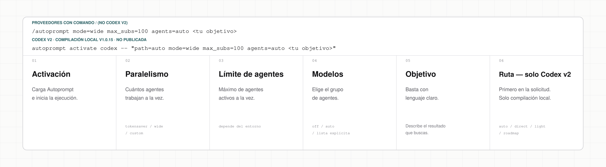
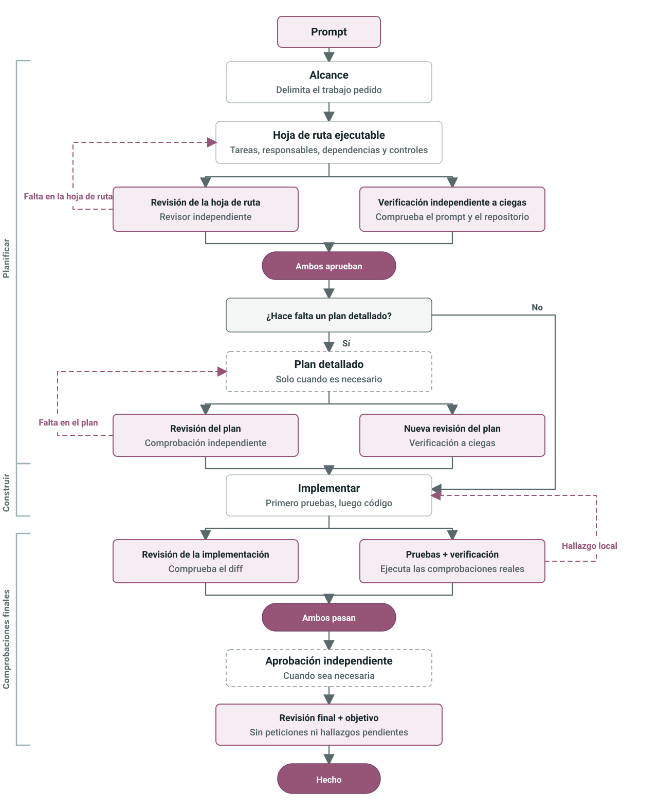
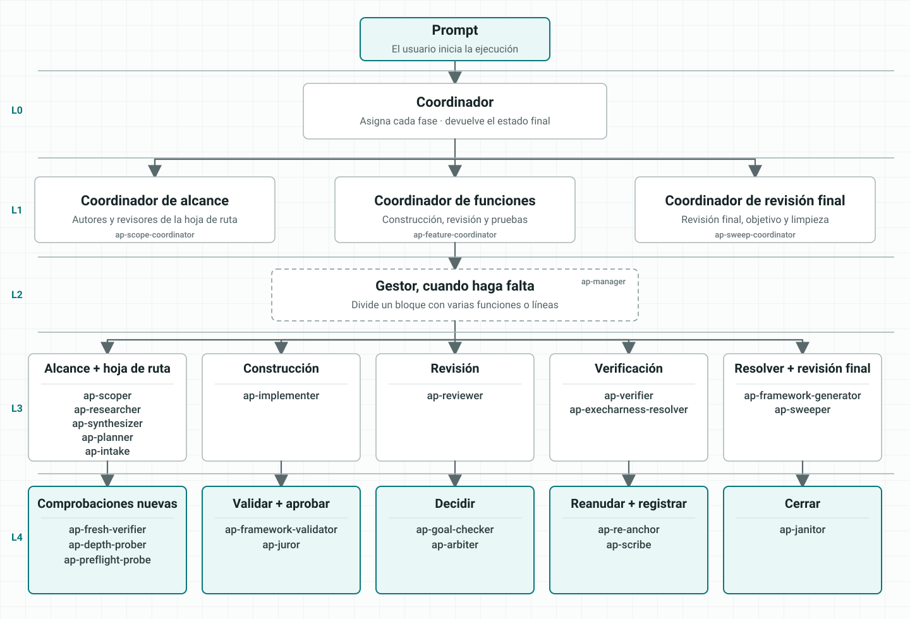

<h1 align="center">Autoprompt</h1>

<p align="center">Autoprompt es una skill para agentes de código con enrutamiento explícito, delegación limitada y comprobaciones basadas en evidencia.</p>

<p align="center">
  <a href="https://github.com/Spielewoy/autoprompt-skill/releases/latest"></a>
  <a href="#instalar"></a>
  <a href="../../LICENSE"></a>
</p>

<p align="center">
  <a href="../../README.md">English</a> |
  <a href="zh.md">中文</a> |
  <a href="ko.md">한국어</a> |
  <a href="es.md"><b>Español</b></a> |
  <a href="ar.md">العربية</a>
</p>

## Contenido

[Instalar](#instalar) · [Benchmarks](#benchmarks) · [Invocación](#anatomía-de-una-invocación) · [Controles](#controles-de-ejecución) · [Cómo funciona](#cómo-funciona) · [Agentes](#agentes) · [Ejemplos](#ejemplos) · [Preguntas](#preguntas-frecuentes) · [Licencia](#licencia)

## Instalar

Usa la CLI siguiente o descarga un instalador desde [GitHub Releases](https://github.com/Spielewoy/autoprompt-skill/releases/tag/v1.0.4).

### 1. Instala la CLI

```bash
npm install -g autoprompt-skill
```

### 2. Abre el instalador

```bash
autoprompt
```

### 3. Instala

Elige tu agente, confirma la ruta e instala. `N` permite introducir otra ruta.

Para otra CLI o IDE, elige `Custom coding agent` y sigue la [guía de compatibilidad](../guides/custom-agent-compatibility.md).

<details>
<summary><strong>Instalar desde el código fuente</strong></summary>

```bash
git clone https://github.com/Spielewoy/autoprompt-skill
cd autoprompt-skill
npm install -g .
autoprompt
```

</details>

### Requisitos

- [Node.js 20+](https://nodejs.org/en/download)
- [Python 3.11+](https://www.python.org/downloads/) disponible como `python`, con [PyYAML](https://pypi.org/project/PyYAML/)
- [Bash 4.3+](https://www.gnu.org/software/bash/) en macOS o Linux
- [Git](https://git-scm.com/downloads) solo para la copia desde GitHub

### Compatibilidad

| Estado | Agente de programación | Requisito auditado | Clave |
|---|---|---|---|
| Operativo | [Claude Code](https://code.claude.com/docs/en/setup) | 2.1.219+; auditado con 2.1.233 | `claude` |
| Operativo | [Codex](https://github.com/openai/codex) | Versión con subagentes; trabajo v2 actual auditado con 0.148.0 | `codex` |
| Operativo | [OpenCode](https://opencode.ai/docs/agents) | 1.18.7+; auditado con 1.18.18 | `opencode` |
| Operativo | [Kilo Code](https://kilo.ai/docs/customize/custom-subagents) | 7.4.22+; auditado con 7.4.22 | `kilo` |
| Operativo | [VS Code](https://code.visualstudio.com/docs/agents/subagents) | 1.133+; auditado con 1.133.0 y Copilot 0.61.0 | `vscode` |
| Operativo | [Prime Agent](https://github.com/PrimeIntellect-ai/prime-agent) | 0.7.2; auditado con 0.7.2; adaptador de paquete nativo | `prime` |
| Operativo | [Oh My Pi](https://omp.sh/) | 17.4.0+; contrato del adaptador, ciclo de instalación y carga de roles nativos verificados con 17.4.0 | `omp` |
| Operativo | [DeepSeek Harness](https://deepseek.com/harness/en/) | 0.1.0-rc.7+; contrato del adaptador, ciclo de instalación y carga de roles nativos verificados con 0.1.0-rc.7 | `deepseek` |
| Operativo | [Reasonix](https://reasonix.io/docs/) | 1.30.0+; contrato del adaptador, ciclo de instalación y carga de roles nativos verificados con 1.30.0 | `reasonix` |

Consulta las [notas de soporte y auditoría](../faq/which-coding-agents-are-supported.md).

### Comprobar, actualizar o eliminar

- Comprobar todas las instalaciones detectadas: `autoprompt doctor --strict`
- Comprobar un proveedor: `autoprompt doctor PROVIDER --strict`
- Actualizar o reparar: ejecuta `autoprompt` y elige un proveedor instalado
- Desinstalar de forma interactiva: `autoprompt uninstall`
- Desinstalar un proveedor: `autoprompt uninstall PROVIDER`
- Mostrar todos los comandos: `autoprompt help`

Sustituye `PROVIDER` por una clave de la tabla de compatibilidad, como `claude`, `codex` o `prime`.

## Benchmarks

Autoprompt no formula actualmente ninguna afirmación reproducible sobre rendimiento o coste. La comparación histórica no conservó los artefactos ni la telemetría necesarios para reconstruirla; consulta el [límite de la evidencia archivada](../benchmarks/terminal-bench-2.1.md). Las afirmaciones futuras deben proceder del pipeline firmado de evidencias del benchmark.

## Anatomía de una invocación

<p align="center">
  <a href="../../assets/i18n/es/anatomy.svg"></a>
</p>

## Controles de ejecución

<!-- codex-v2-release-status: local-v1.0.25-build-not-published -->
> Estado de `path=` en Codex v2: compilación local v1.0.25; no publicada.

Usa `mode=` para definir la concurrencia. Usa `agents=` para dirigir modelos cuando el agente lo admita. La compilación local de Codex v2 también admite el control opcional `path=`.

| Control | Claude Code | Codex | OpenCode | Kilo | VS Code | Prime Agent | Oh My Pi | DeepSeek Harness | Reasonix |
|---|:---:|:---:|:---:|:---:|:---:|:---:|:---:|:---:|:---:|
| `mode=` | ✓ | ✓ | ✓ | ✓ | ✓ | ✓ | ✓ | ✓ | ✓ |
| Enrutamiento personalizado con `agents=` | ✓ | ✓ | ✕ No disponible - hereda el modelo activo | ✕ No disponible - hereda el modelo activo | ✕ No disponible - hereda el modelo activo | ✕ No disponible - hereda el modelo padre seleccionado | ✕ No disponible - hereda el modelo padre seleccionado | ✕ No disponible - hereda el modelo padre seleccionado | ✕ No disponible - hereda el modelo padre seleccionado |
| Ruta de trabajo `path=` | - | Compilación local v1.0.25; no publicada | - | - | - | - | - | - | - |

En Codex v2, coloca `path=auto|direct|light|roadmap` al principio de la solicitud, por ejemplo `autoprompt activate codex -- path=direct <objetivo>`. Omitir `path=` equivale a `path=auto` y conserva la selección automática. Una ruta explícita omite el trabajo de modelos dedicado al análisis y la selección de ruta, pero no las comprobaciones de seguridad y autorización, los entregables propios de la ruta, la ejecución ni la verificación independiente. Si una selección es inválida, conflictiva o inutilizable, falla de forma segura en vez de cambiarla silenciosamente.

## Cómo funciona

<p align="center">
  
</p>

## Agentes

<p align="center">
  
</p>

## Ejemplos

| Objetivo | Prompt |
|---|---|
| Corregir | `/autoprompt corrige la condición de carrera del registro y añade una prueba de regresión` |
| Construir | `/autoprompt mode=wide construye el flujo de reservas desde la API hasta el pago` |
| Investigar | `/autoprompt compara colas de trabajos para este repositorio y recomienda una` |
| Limitar trabajo paralelo | `/autoprompt mode=custom max_subs=4 migra todos los modelos` |
| Probar una ruta de Codex v2 en desarrollo | `autoprompt activate codex -- path=light añade reintentos y cubre los casos límite` |

En Codex v2, ejecuta `autoprompt activate codex -- <objetivo>`; el lanzador inyecta internamente el sobre privado `$autoprompt`. En Oh My Pi, usa `/skill:autoprompt`.

## Preguntas frecuentes

<details>
<summary><strong>¿Significa Autoprompt que de verdad no tengo que escribir prompts?</strong></summary>

No. Dale un objetivo claro, restricciones y criterios de éxito. Autoprompt se ocupa del ciclo de ejecución, así que no tienes que escribir un prompt para cada paso. [Detalles](../faq/does-autoprompt-mean-i-do-not-have-to-prompt.md)

</details>

<details>
<summary><strong>¿Hasta qué punto es autónomo Autoprompt?</strong></summary>

Puede delimitar, implementar, probar, revisar, reparar y verificar un objetivo. Se detiene ante decisiones que cambian el resultado, acciones que necesitan tu autorización o bloqueos que no puede resolver de forma segura. [Detalles](../faq/how-autonomous-is-autoprompt.md)

</details>

<details>
<summary><strong>¿Para qué sirven las capas?</strong></summary>

Las capas separan la coordinación, la gestión, la ejecución y la evaluación independiente. Así, un mismo agente no planifica, aprueba y verifica su propio trabajo. [Detalles](../faq/what-are-the-layers-for.md)

</details>

<details>
<summary><strong>¿Qué controlan `mode`, `max_subs`, `agents` y `path`?</strong></summary>

`mode=tokensaver` limita los subagentes activos a seis; `mode=wide` abre todas las líneas listas; `mode=custom max_subs=N` fija tu propio límite; `agents` controla el enrutamiento de modelos cuando el agente lo admite; en Codex v2 en desarrollo, `path` fija opcionalmente la ruta de trabajo y, si se omite, la selección sigue siendo automática. [Detalles](../faq/tokensaver-vs-wide-vs-custom.md)

</details>

<details>
<summary><strong>¿Por qué Autoprompt no se inicia en segundo plano?</strong></summary>

Porque cambia el coste, el tiempo y el flujo de trabajo. Inícialo de forma explícita con `/autoprompt <objetivo>` en los hosts compatibles, o con `autoprompt activate codex -- <objetivo>` en Codex v2.

</details>

## Licencia

[MIT](../../LICENSE). Copyright 2026 [Spielewoy](https://github.com/Spielewoy).

Comunidad: [Contribuir](../CONTRIBUTING.md), [Código de conducta](../CODE_OF_CONDUCT.md), [Seguridad](../SECURITY.md) y [Soporte](../SUPPORT.md).
