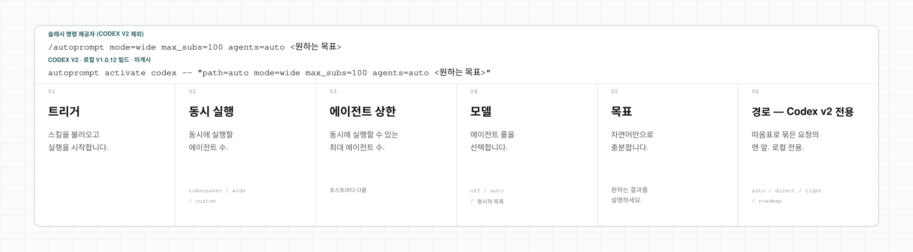
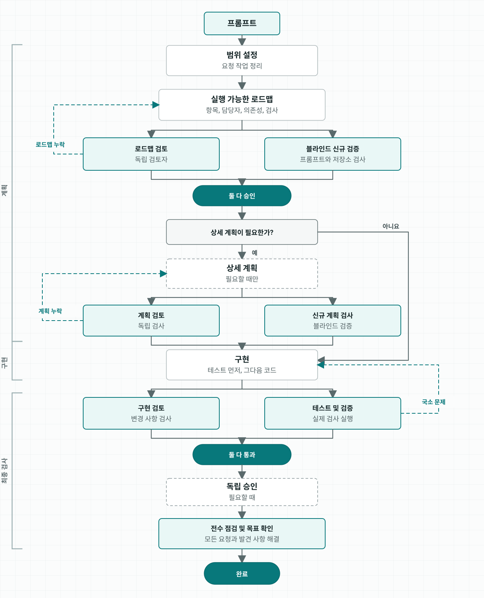
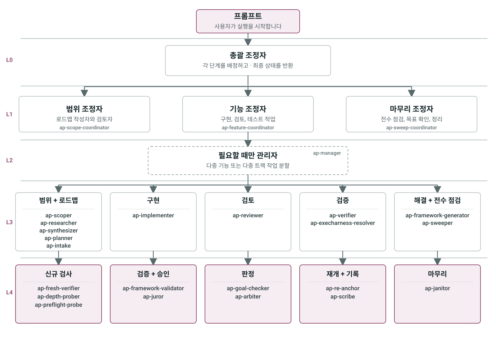

<h1 align="center">Autoprompt</h1>

<p align="center">Autoprompt는 명시적 라우팅, 제한된 위임, 근거 기반 검사를 제공하는 코딩 에이전트 스킬입니다.</p>

<p align="center">
  <a href="https://github.com/Spielewoy/autoprompt-skill/releases/latest"></a>
  <a href="#설치"></a>
  <a href="../../LICENSE"></a>
</p>

<p align="center">
  <a href="../../README.md">English</a> |
  <a href="zh.md">中文</a> |
  <a href="ko.md"><b>한국어</b></a> |
  <a href="es.md">Español</a> |
  <a href="ar.md">العربية</a>
</p>

## 목차

[설치](#설치) · [벤치마크](#벤치마크) · [호출](#호출-구조) · [실행 제어](#실행-제어) · [작동 방식](#작동-방식) · [에이전트](#에이전트) · [예시](#예시) · [FAQ](#자주-묻는-질문) · [라이선스](#라이선스)

## 설치

아래 CLI를 사용하거나 [GitHub Releases](https://github.com/Spielewoy/autoprompt-skill/releases/tag/v1.0.4)에서 설치 프로그램을 받으세요.

### 1. CLI 설치

```bash
npm install -g autoprompt-skill
```

### 2. 설치 프로그램 실행

```bash
autoprompt
```

### 3. 설치

코딩 에이전트를 고르고 경로를 확인한 뒤 설치하세요. `N`은 다른 경로 입력입니다.

다른 CLI나 IDE에서는 `Custom coding agent`를 선택하고 [호환성 가이드](../guides/custom-agent-compatibility.md)를 따르세요.

<details>
<summary><strong>소스에서 설치</strong></summary>

```bash
git clone https://github.com/Spielewoy/autoprompt-skill
cd autoprompt-skill
npm install -g .
autoprompt
```

</details>

### 요구 사항

- [Node.js 20+](https://nodejs.org/en/download)
- `python` 명령으로 제공되는 [Python 3.11+](https://www.python.org/downloads/)와 [PyYAML](https://pypi.org/project/PyYAML/)
- macOS 또는 Linux에서는 [Bash 4.3+](https://www.gnu.org/software/bash/)
- GitHub에서 설치할 때만 [Git](https://git-scm.com/downloads)

### 지원 범위

| 상태 | 코딩 도구 | 검증 기준 | 키 |
|---|---|---|---|
| 지원 | [Claude Code](https://code.claude.com/docs/en/setup) | 2.1.219+; 2.1.233 검증 완료 | `claude` |
| 지원 | [Codex](https://github.com/openai/codex) | 서브에이전트 지원 빌드; 현재 v2 작업은 0.148.0에서 검증 | `codex` |
| 지원 | [OpenCode](https://opencode.ai/docs/agents) | 1.18.7+; 1.18.18 검증 완료 | `opencode` |
| 지원 | [Kilo Code](https://kilo.ai/docs/customize/custom-subagents) | 7.4.22+; 7.4.22 검증 완료 | `kilo` |
| 지원 | [VS Code](https://code.visualstudio.com/docs/agents/subagents) | 1.133+; VS Code 1.133.0 및 Copilot 0.61.0 검증 완료 | `vscode` |
| 지원 | [Prime Agent](https://github.com/PrimeIntellect-ai/prime-agent) | 0.7.2; 0.7.2 검증 완료; 네이티브 패키지 어댑터 | `prime` |
| 지원 | [Oh My Pi](https://omp.sh/) | 17.4.0+; 17.4.0에서 어댑터 계약, 설치 수명주기, 네이티브 역할 페이로드 검증 완료 | `omp` |
| 지원 | [DeepSeek Harness](https://deepseek.com/harness/en/) | 0.1.0-rc.7+; 0.1.0-rc.7에서 어댑터 계약, 설치 수명주기, 네이티브 역할 페이로드 검증 완료 | `deepseek` |
| 지원 | [Reasonix](https://reasonix.io/docs/) | 1.30.0+; 1.30.0에서 어댑터 계약, 설치 수명주기, 네이티브 역할 페이로드 검증 완료 | `reasonix` |

[지원 및 검증 정보](../faq/which-coding-agents-are-supported.md)를 참고하세요.

### 검사, 업데이트 또는 제거

- 감지된 모든 설치 검사: `autoprompt doctor --strict`
- 한 코딩 에이전트 검사: `autoprompt doctor PROVIDER --strict`
- 업데이트 또는 복구: `autoprompt`를 실행하고 설치된 에이전트 선택
- 대화형 제거: `autoprompt uninstall`
- 한 코딩 에이전트 제거: `autoprompt uninstall PROVIDER`
- 전체 명령 보기: `autoprompt help`

`PROVIDER`는 지원 표의 키로 바꾸세요. 예: `claude`, `codex`, `prime`.

## 벤치마크

Autoprompt는 현재 재현 가능한 성능 또는 비용 주장을 하지 않습니다. 과거 비교에는 재구성에 필요한 아티팩트와 텔레메트리가 보존되지 않았습니다. [보관된 근거의 한계](../benchmarks/terminal-bench-2.1.md)를 참고하세요. 향후 주장은 서명된 벤치마크 근거 파이프라인에서 생성되어야 합니다.

## 호출 구조

<p align="center">
  <a href="../../assets/i18n/ko/anatomy.svg"></a>
</p>

## 실행 제어

<!-- codex-v2-release-status: local-v1.0.26-build-not-published -->
> Codex v2 `path=` 상태: 로컬 v1.0.26 빌드이며 아직 게시되지 않았습니다.

`mode=`로 동시 실행을 설정하고, 호스트가 지원하면 `agents=`로 모델을 라우팅하세요. 로컬 Codex v2 빌드에서는 선택 사항인 `path=` 제어도 사용할 수 있습니다.

| 제어 | Claude Code | Codex | OpenCode | Kilo | VS Code | Prime Agent | Oh My Pi | DeepSeek Harness | Reasonix |
|---|:---:|:---:|:---:|:---:|:---:|:---:|:---:|:---:|:---:|
| `mode=` | ✓ | ✓ | ✓ | ✓ | ✓ | ✓ | ✓ | ✓ | ✓ |
| 사용자 지정 `agents=` 라우팅 | ✓ | ✓ | ✕ 미지원 - 활성 모델 사용 | ✕ 미지원 - 활성 모델 사용 | ✕ 미지원 - 활성 모델 사용 | ✕ 미지원 - 선택한 부모 모델 사용 | ✕ 미지원 - 선택한 부모 모델 사용 | ✕ 미지원 - 선택한 부모 모델 사용 | ✕ 미지원 - 선택한 부모 모델 사용 |
| `path=` 작업 경로 | - | 로컬 v1.0.26 빌드; 미게시 | - | - | - | - | - | - | - |

Codex v2에서는 요청 맨 앞에 `path=auto|direct|light|roadmap`을 넣으세요. 예: `autoprompt activate codex -- path=direct <목표>`. `path=`를 생략하면 `path=auto`와 같으며 자동 선택을 유지합니다. 명시적 경로는 경로 분석 및 선택을 위한 모델 작업을 건너뛰지만 안전·권한 검사, 경로별 결과물, 실행, 독립 검증은 건너뛰지 않습니다. 잘못되거나 충돌하거나 사용할 수 없는 선택은 다른 경로로 조용히 바꾸지 않고 안전하게 실패합니다.

## 작동 방식

<p align="center">
  
</p>

## 에이전트

<p align="center">
  
</p>

## 예시

| 목표 | 프롬프트 |
|---|---|
| 수정 | `/autoprompt 등록 경쟁 조건을 수정하고 회귀 테스트를 추가해 줘` |
| 구축 | `/autoprompt mode=wide API부터 결제까지 예약 흐름을 구축해 줘` |
| 조사 | `/autoprompt 이 코드베이스에 맞는 작업 큐를 비교하고 하나를 추천해 줘` |
| 동시 실행 제한 | `/autoprompt mode=custom max_subs=4 모든 모델을 마이그레이션해 줘` |
| 개발 중인 Codex v2 경로 테스트 | `autoprompt activate codex -- path=light 재시도 동작을 추가하고 경계 사례를 검사해 줘` |

Codex v2에서는 `autoprompt activate codex -- <목표>`를 실행하세요. 런처가 비공개 `$autoprompt` 봉투를 내부에서 주입합니다. Oh My Pi에서는 `/skill:autoprompt`를 사용하세요.

## 자주 묻는 질문

<details>
<summary><strong>Autoprompt를 쓰면 정말 프롬프트를 작성하지 않아도 되나요?</strong></summary>

아니요. 명확한 목표, 제약 조건, 성공 기준을 제공해야 합니다. Autoprompt가 실행 루프를 담당하므로 단계마다 프롬프트를 작성할 필요는 없습니다. [자세히 보기](../faq/does-autoprompt-mean-i-do-not-have-to-prompt.md)

</details>

<details>
<summary><strong>Autoprompt는 어디까지 자율적으로 처리하나요?</strong></summary>

목표의 범위를 정하고 구현, 테스트, 검토, 수정, 검증할 수 있습니다. 결과를 바꾸는 선택, 사용자 권한이 필요한 작업, 안전하게 해결할 수 없는 장애물에서는 멈춥니다. [자세히 보기](../faq/how-autonomous-is-autoprompt.md)

</details>

<details>
<summary><strong>계층을 나눈 이유는 무엇인가요?</strong></summary>

각 계층은 조정, 관리, 실행, 독립 판단을 분리합니다. 이 구조 덕분에 한 에이전트가 자신의 작업을 계획하고 승인하고 검증하는 일을 모두 맡지 않습니다. [자세히 보기](../faq/what-are-the-layers-for.md)

</details>

<details>
<summary><strong>`mode`, `max_subs`, `agents`, `path`는 무엇을 제어하나요?</strong></summary>

`mode=tokensaver`는 활성 서브에이전트를 6개로 제한하고, `mode=wide`는 준비된 모든 작업을 엽니다. `mode=custom max_subs=N`은 사용자 지정 상한을 정하며, `agents`는 호스트가 지원할 때 모델 라우팅을 제어합니다. 개발 중인 Codex v2의 `path`는 작업 경로를 선택 사항으로 고정하며, 생략하면 자동 선택이 유지됩니다. [자세히 보기](../faq/tokensaver-vs-wide-vs-custom.md)

</details>

<details>
<summary><strong>Autoprompt가 백그라운드에서 시작되지 않는 이유는 무엇인가요?</strong></summary>

비용, 시간, 작업 흐름이 달라지기 때문입니다. 호환 호스트에서는 `/autoprompt <목표>`로, Codex v2에서는 `autoprompt activate codex -- <목표>`로 명시적으로 시작하세요.

</details>

## 라이선스

[MIT](../../LICENSE). 저작권 2026 [Spielewoy](https://github.com/Spielewoy).

커뮤니티: [기여 안내](../CONTRIBUTING.md), [행동 강령](../CODE_OF_CONDUCT.md), [보안 정책](../SECURITY.md), [지원](../SUPPORT.md).
